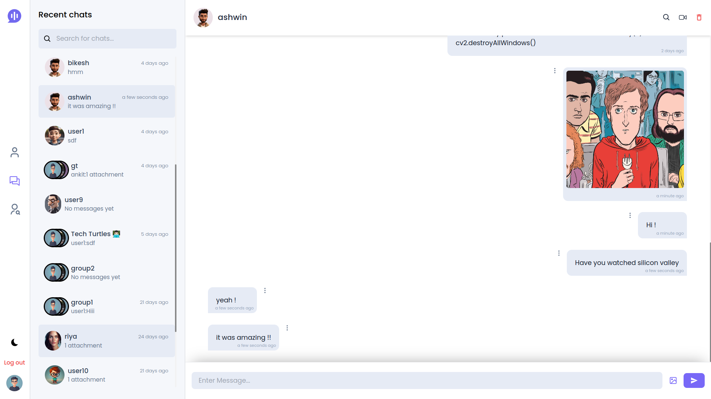
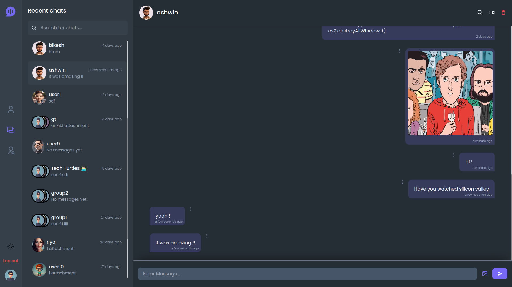

<div align="center">

# BaatCheet

Real-time chat app with private/group messaging, file sharing, and video calling.

[](https://nodejs.org/)
[](https://react.dev/)
[](https://www.typescriptlang.org/)
[](https://www.mongodb.com/)
[](https://socket.io/)
[](https://tailwindcss.com/)

</div>

## What’s in this repo

- Backend API (Express + TypeScript): [backend/](backend/)
- Frontend app (React + Vite + Tailwind): [client/](client/)

Docs:
- Backend setup: [backend/README.md](backend/README.md)
- Frontend setup: [client/README.md](client/README.md)

## Features

- Real-time messaging (private + group chats)
- File sharing (uploads + downloads)
- Message deletion synced to everyone in the chat
- Video calling via WebRTC (signaling over Socket.IO)
- Light/dark theme + polished UI

## Screenshots

| Light | Dark |
|---|---|
|  |  |

More in [screenshots/](screenshots/).

## Quickstart (local dev)

### Prerequisites

- Node.js 18+
- MongoDB:
	- Option A: local MongoDB (`mongodb://localhost:27017`)
	- Option B: MongoDB Atlas (`mongodb+srv://...`)

### 1) Backend

```sh
cd backend
npm install
```

Create `backend/.env` from the sample:

- Windows (PowerShell):
	```sh
	copy .env.sample .env
	```
- macOS / Linux:
	```sh
	cp .env.sample .env
	```

For local dev, make sure these values match your machine:

```env
# backend/.env (local dev defaults)
PORT=5000
SERVER_URL=http://localhost:5000

# Vite dev server runs on 5173
CORS_URL=http://localhost:5173

# Local Mongo
DB_URL=mongodb://localhost:27017
DB_NAME=BaatCheet

# Or MongoDB Atlas:
# DB_URL=mongodb+srv://<user>:<pass>@<cluster>/<db>?retryWrites=true&w=majority
```

Start the API:

```sh
npm run dev
```

API runs on `http://localhost:5000`.

### 2) Frontend

```sh
cd client
npm install
```

Create `client/.env` from the sample:

- Windows (PowerShell):
	```sh
	copy .env.sample .env
	```
- macOS / Linux:
	```sh
	cp .env.sample .env
	```

For local dev, typical values are:

```env
VITE_SERVER_URL=http://localhost:5000/
VITE_SOCKET_URI=http://localhost:5000

# For local testing you can point signaling to the same server
VITE_SIGNALLING_SERVER_URL=http://localhost:5000/
```

Run the app:

```sh
npm run dev
```

Open `http://localhost:5173`.

> If `npm install` hits a peer dependency conflict, try `npm install --legacy-peer-deps`.

## Run with Docker (optional)

This repo includes `docker-compose.yml`.

```sh
docker compose up --build
```

- Backend: `http://localhost:5000`
- Frontend (nginx): `http://localhost:3002`

When running via Docker, use the provided `.env.sample` values (notably `CORS_URL=http://localhost:3002` and `DB_URL=mongodb://mongod:27017`).

## Project layout (high level)

```
.
├── backend/
│   └── src/
│       ├── controllers/
│       ├── routes/
│       ├── middlewares/
│       ├── database/
│       ├── socket/
│       └── server.ts
├── client/
│   └── src/
│       ├── components/
│       ├── context/
│       ├── hooks/
│       ├── pages/
│       └── api/
└── docker-compose.yml
```

## Troubleshooting

- CORS error in browser: make sure `backend/.env` has `CORS_URL` set to your frontend origin.
- Atlas URI with special characters: URL-encode your password (`@` → `%40`, `#` → `%23`, etc.).
- Socket connection issues: ensure `VITE_SOCKET_URI` points to the backend (default `http://localhost:5000`).

## Contributing

Issues and PRs are welcome. If you’re planning a bigger change, open an issue first so we can align on the approach.

## License

No license file is included in this repository right now. If you plan to publish/distribute it, add a license that matches your intent.
